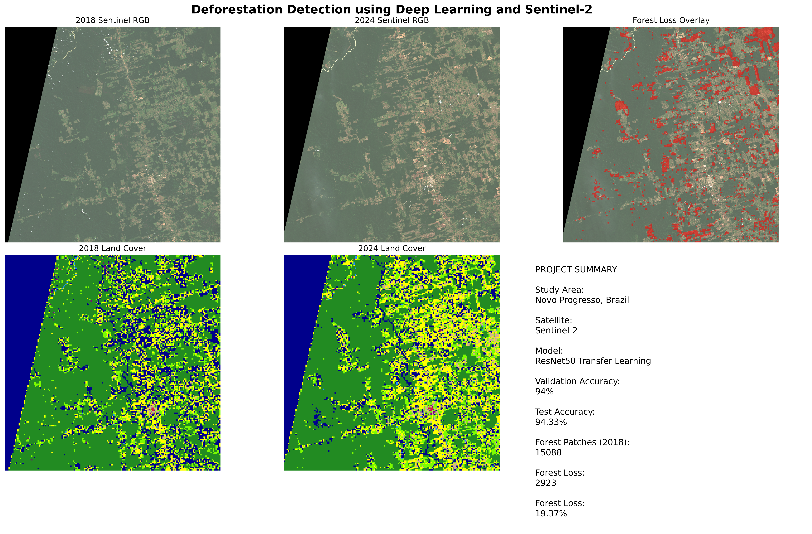
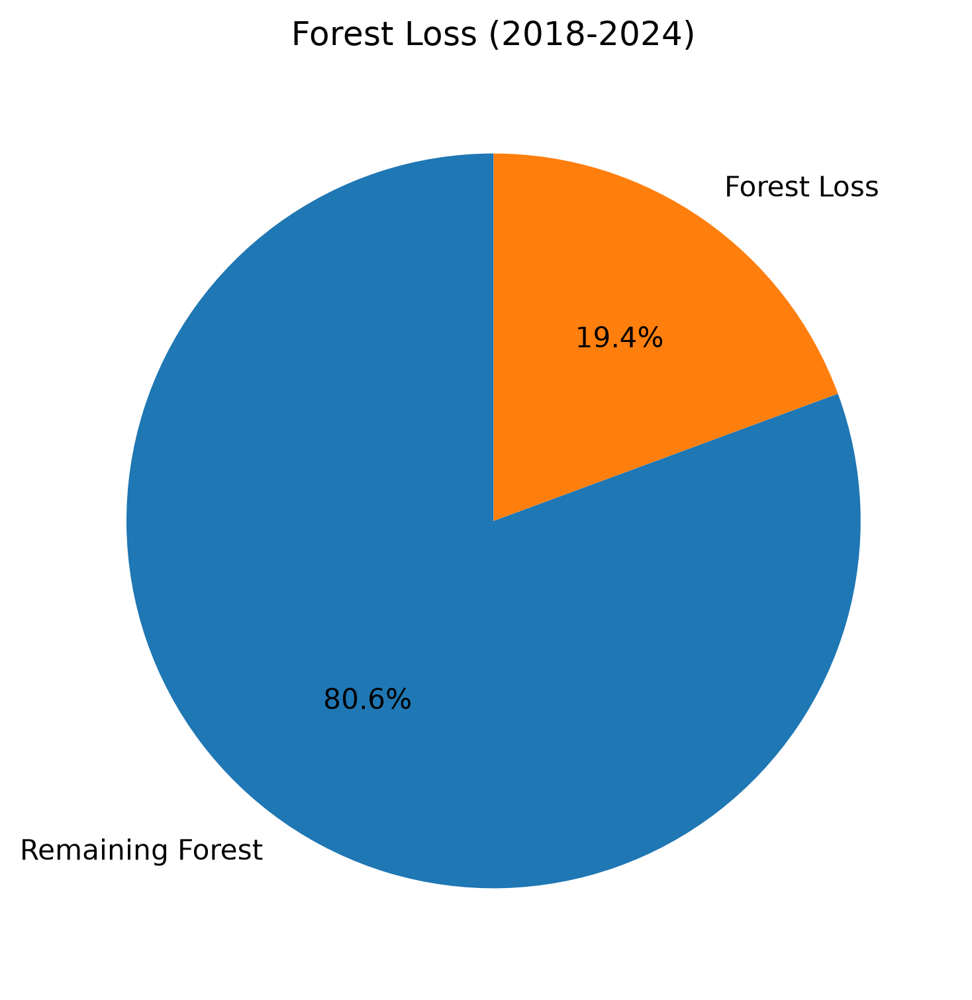
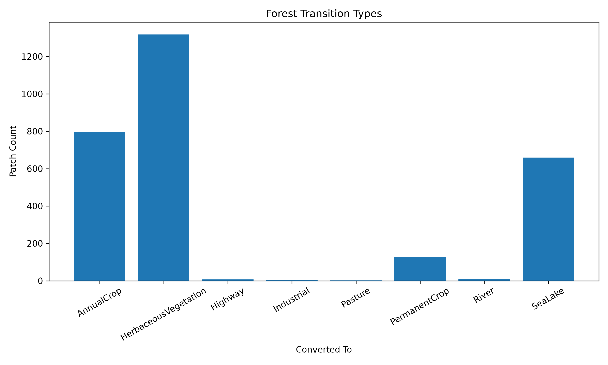

# 🌍 Deforestation Detection using Deep Learning


# 🌍 Deforestation Detection using Deep Learning and Sentinel-2

An end-to-end deep learning pipeline that detects forest loss from multi-temporal Sentinel-2 satellite imagery using Transfer Learning with ResNet50.

The project classifies satellite image patches into land-cover categories, generates land-cover maps for different years, and identifies regions where forests have disappeared over time.

---

## 🚀 Features

- End-to-end remote sensing pipeline
- Sentinel-2 satellite image preprocessing
- Automatic patch generation
- Transfer Learning using ResNet50
- EuroSAT land-cover classification
- Land-cover map generation
- Forest loss detection
- Change detection between years
- Interactive visualizations
- Automated project dashboard

---

# Project Pipeline

```
Sentinel-2 Images
        │
        ▼
Preprocessing
(RGB Extraction)
        │
        ▼
Patch Generation
(64×64)
        │
        ▼
Image Transforms
        │
        ▼
ResNet50 (Transfer Learning)
        │
        ▼
Patch Classification
        │
        ▼
Land Cover Maps
        │
        ▼
2018 vs 2024 Comparison
        │
        ▼
Forest Loss Detection
        │
        ▼
Statistics + Visualizations
```

---

# Folder Structure

```
Deforestation-Detection/

│
├── data/
│   ├── raw/
│   ├── processed/
│   ├── patches/
│   ├── metadata/
│   └── predictions/
│
├── models/
│   └── checkpoints/
│       └── best_model.pth
│
├── outputs/
│
├── notebooks/
│
├── src/
│   ├── preprocess_sentinel.py
│   ├── generate_patches.py
│   ├── dataset.py
│   ├── dataloader.py
│   ├── transforms.py
│   ├── model.py
│   ├── train.py
│   ├── run_inference.py
│   ├── generate_landcover.py
│   ├── detect_deforestation.py
│   ├── create_dashboard.py
│   └── utils.py
│
├── requirements.txt
└── README.md
```

---

# Dataset

## EuroSAT

- 27,000 Sentinel-2 images
- 10 land-cover classes

Classes:

- AnnualCrop
- Forest
- HerbaceousVegetation
- Highway
- Industrial
- Pasture
- PermanentCrop
- Residential
- River
- SeaLake

---

# Model

Transfer Learning using

```
ResNet50
```

Pretrained on

```
ImageNet
```

Only the final fully-connected layer is retrained.

---

# Data Preprocessing

Each Sentinel image undergoes

- RGB extraction
- Patch generation
- Resize (224×224)
- Normalization
- Data augmentation

Training augmentation includes

- Horizontal Flip
- Vertical Flip

---

# Training

Loss Function

```
CrossEntropyLoss
```

Optimizer

```
Adam
```

Learning Rate

```
0.001
```

Epochs

```
10
```

---

# Results

| Metric                 | Value  |
| ---------------------- | ------ |
| Validation Accuracy    | 94%    |
| Test Accuracy          | 94.33% |
| Forest Patches (2018)  | 15,088 |
| Forest Loss            | 2,923  |
| Forest Loss Percentage | 19.37% |

---

# Generated Outputs

The pipeline automatically produces

- Land Cover Maps
- Prediction CSVs
- Forest Loss Mask
- Forest Loss Overlay
- Deforestation Map
- Transition Matrix
- Change Statistics
- Final Dashboard

---

# Sample Results

## Final Dashboard



---

## Forest Loss Overlay


---

## Deforestation Map


---

## Land Cover Comparison


---

## Forest Loss Statistics



---

## Transition Analysis



---

# Installation

Clone the repository

```bash
git clone https://github.com/MayukhCANTcode/Deforestation-Detection.git
```

Install dependencies

```bash
pip install -r requirements.txt
```

---

# Usage

### 1. Preprocess Sentinel Images

```bash
python src/preprocess_sentinel.py
```

---

### 2. Generate Image Patches

```bash
python src/generate_patches.py
```

---

### 3. Train the Model

```bash
python src/train.py
```

---

### 4. Run Inference

```bash
python src/run_inference.py
```

---

### 5. Generate Land Cover Maps

```bash
python src/generate_landcover.py
```

---

### 6. Detect Forest Loss

```bash
python src/detect_deforestation.py
```

---

### 7. Create Final Dashboard

```bash
python src/create_dashboard.py
```

---

# Technologies Used

- Python
- PyTorch
- Torchvision
- Rasterio
- NumPy
- Pandas
- OpenCV
- Matplotlib
- PIL
- Sentinel-2
- EuroSAT

---

# Future Improvements

- Semantic segmentation using U-Net
- Vision Transformers
- Temporal Attention Networks
- Multi-spectral Sentinel bands
- Cloud deployment
- Interactive web dashboard
- Near real-time monitoring

---

# Author

**Mayukh Das**

Electronics & Instrumentation Engineering

National Institute of Technology Silchar

---

# License

This project is released under the MIT License.
